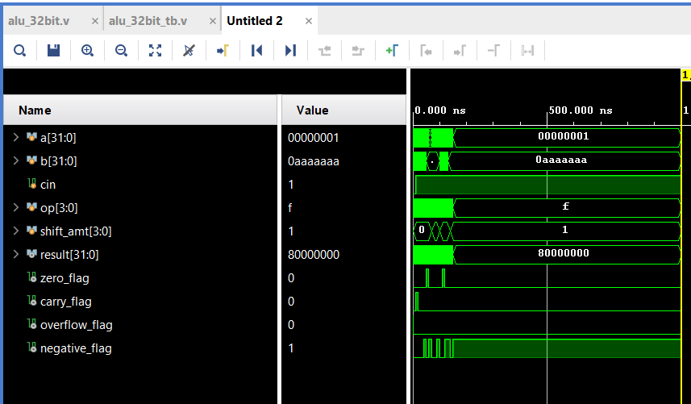

# ALU_32bit

A fully synthesizable **32-bit Arithmetic Logic Unit (ALU)** implemented in Verilog, designed and simulated using **Xilinx Vivado**. Supports 16 operations including arithmetic, logic, shift, rotate, and multiplication via a dedicated array multiplier module.

---

## Features

- 16 operations controlled by a 4-bit opcode
- Carry-Lookahead Adder (CLA) for fast addition and subtraction
- 32x32 array multiplier (result truncated to lower 32 bits)
- Arithmetic right shift using signed Verilog extension
- Barrel shifter and barrel rotator for SLL, SRL, SRA, ROL, ROR
- Status flags: Zero, Negative, Carry, Overflow

---

## Inputs / Outputs

| Port | Width | Direction | Description |
|------|-------|-----------|-------------|
| A | 32-bit | Input | Operand A |
| B | 32-bit | Input | Operand B |
| opcode | 4-bit | Input | Operation select |
| shamt | 5-bit | Input | Shift/rotate amount |
| result | 32-bit | Output | Operation result |
| Z | 1-bit | Output | Zero flag |
| N | 1-bit | Output | Negative flag |
| C | 1-bit | Output | Carry flag (ADD/SUB only) |
| V | 1-bit | Output | Overflow flag (ADD/SUB only) |

---

## Operation Table

| Opcode | Operation | Description |
|--------|-----------|-------------|
| 0000 | ADD | A + B (with carry) |
| 0001 | SUB | A − B (two's complement) |
| 0010 | AND | Bitwise AND |
| 0011 | OR | Bitwise OR |
| 0100 | XOR | Bitwise XOR |
| 0101 | NOT | Bitwise NOT (B ignored) |
| 0110 | SLL | Logical left shift by shamt |
| 0111 | SRL | Logical right shift by shamt |
| 1000 | SRA | Arithmetic right shift by shamt |
| 1001 | SLT | Set less than (signed) |
| 1010 | MUL | Multiply A × B (lower 32 bits) |
| 1011 | NAND | Bitwise NAND |
| 1100 | NOR | Bitwise NOR |
| 1101 | XNOR | Bitwise XNOR |
| 1110 | ROL | Rotate left by shamt (B ignored) |
| 1111 | ROR | Rotate right by shamt (B ignored) |

---

## Flags

| Flag | When Set | Operations |
|------|----------|------------|
| Z (Zero) | result == 0 | All operations |
| N (Negative) | result[31] == 1 | All operations |
| C (Carry) | Carry out of bit 31 | ADD, SUB only |
| V (Overflow) | Signed overflow | ADD, SUB only |

C and V are set to 0 for all non-arithmetic operations.

---

## Module Hierarchy

```
alu_32bit (top)
├── adder_subtractor_32bit
│   └── cla_32bit
│       └── cla_16bit (×2)
│           └── cla_4bit (×4)
├── multiplier_32bit (array multiplier)
└── shift / rotate / logic (inline)
```

---

## File Structure

```
ALU_32bit/
├── src/
│   ├── cla_4bit.v
│   ├── cla_16bit.v
│   ├── cla_32bit.v
│   ├── add_sub.v
│   ├── multiplier_32bit.v
│   └── alu_32bit.v
├── sim/
│   └── alu_32bit_tb.v
├── docs/
│   ├── schematic.png
│   └── waveforms/
│       └── waveform.png
├── .gitignore
└── README.md
```

---

## Simulation

Simulated in Vivado using a testbench that covers all 16 opcodes and verifies flag behavior for edge cases including zero result, negative result, carry, and signed overflow.



---

## Schematic


---

## Key Implementation Notes

- **SUB** is implemented as A + (~B) + 1 using the B XOR mode trick in the adder/subtractor
- **SRA** uses `$signed(A) >>> shamt` to preserve the sign bit
- **ROL** = `(A << shamt) | (A >> (32 - shamt))`
- **ROR** = `(A >> shamt) | (A << (32 - shamt))`
- **CLA** uses generate `G[i] = A & B` and propagate `P[i] = A | B` per bit
- **Multiplier** produces a 64-bit result; lower 32 bits are used

---

## Tools Used

- Xilinx Vivado (Simulation & Synthesis)
- Verilog HDL

---

## Future Improvements

- Upgrade CLA to a **Kogge-Stone prefix adder** for improved timing and reduced propagation delay
- Add FPGA pin constraints and synthesize to hardware
- Extend multiplier output to full 64-bit result port
